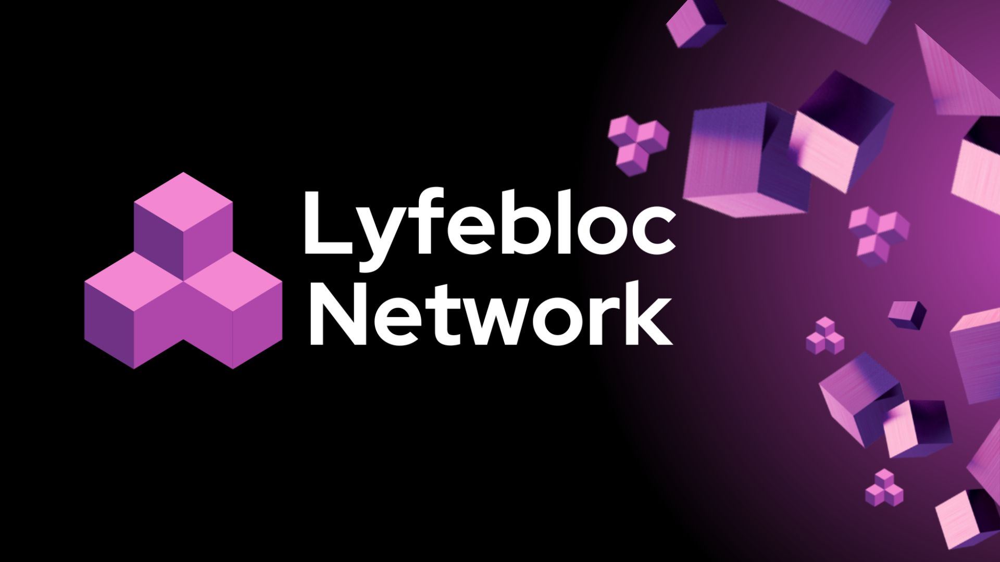

## Lyfebloc Network

Lyfebloc Network is a versatile modular blockchain network that allows anyone to easily and securely set up their own Ethereum-compatible sovereign chain.

To find out more about Lyfebloc Network, visit the [official website](https://lyfeblocnetwork.com/).

WARNING: This is a work in progress so architectural changes may happen in the future. The code has not been audited yet, so please contact [Lyfebloc Network team](mailto:support@lyfebloc.network) if you would like to use it in production.

## Documentation 📝

If you'd like to learn more about the Lyfebloc Network, how it works and how you can use it for your project,
please check out the **[Lyfebloc Network Documentation](https://docs.lyfebloc.network)**.

---

Copyright 2024 Lyfebloc Network

Licensed under the Apache License, Version 2.0 (the "License");
you may not use this file except in compliance with the License.
You may obtain a copy of the License at

       http://www.apache.org/licenses/LICENSE-2.0

Unless required by applicable law or agreed to in writing, software
distributed under the License is distributed on an "AS IS" BASIS,
WITHOUT WARRANTIES OR CONDITIONS OF ANY KIND, either express or implied.
See the License for the specific language governing permissions and
limitations under the License.
